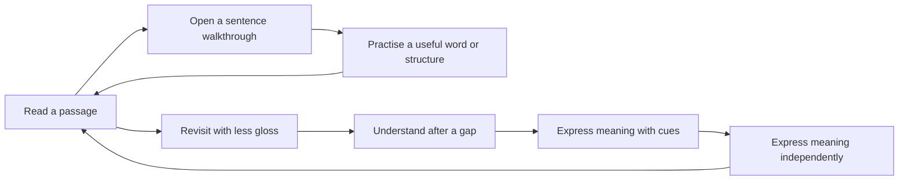

# Sentence-first learning through guided glossing

Date: 2026-09-29  
Revised: 2026-09-30 — episode preparation, speech practice, target quality, transfer and measurement.

Status: Design proposal with the first review-interface slice implemented on `feat/chapter-review`; not deployed.
Starting point: [Roadmap: sentence glossing accessibility](ROADMAP.md#possibilities-sentence-glossing-accessibility), the guided walkthrough, and the sentence mastery/deep-dive work.

## Intent

Implementation checkpoint (2026-09-30): chapter/episode display is now implemented
for vocabulary reading/cloze and grammar recognition, with source selection,
known-form masking, target navigation and unchanged grading. Build and full
unit/integration tests pass; Chromium/WebKit phone/desktop tests pass in Docker
(`e2e/README.md`). This does not implement the remaining card types, new event
scheme, episode preparation, lesson progression or production design below.

Make the sentence and an explanation of how it works the first learning experience. Vocabulary and grammar become things the sentence invites you to learn, and progress in those things makes the sentence progressively more understandable with less help.

The proposed loop is:

> Read a passage → walk through a sentence → practise a useful part → return with less help → revisit later → express its meaning naturally.

Opening a sentence must never require first harvesting its vocabulary, studying those cards, or completing a grammar pass. A sentence can remain partly learned while you continue the book. Existing vocabulary and grammar identities and spaced repetition remain useful underneath this experience.

This deliberately revises the earlier “vocabulary before glossing” product decision documented in `sessionPlanner.ts`. It does not imply that every existing recall test should become available regardless of prerequisites.

## Confirmed direction

The user clarified the following during planning:

- **Passage first:** “Work through a passage, returning to its sentences as I learn.”
- **Production is the destination:** “reproduce is the goal but it will likely require having various steps from learning to acquisition on up to production.”
- **Teaching style:** a Cure Dolly style walkthrough.
- **Final production goal:** “Express the same meaning naturally, even with different Japanese.”
- **Review interface direction:** display the whole chapter or episode, highlight or blank the vocabulary/grammar target in place, and put the question and response section below. This extends the passage-first idea to ordinary reviews as well as new learning.
- **Import and planning scope:** consider the whole incoming episode when choosing learning priorities, including an AI preparation pass if useful.
- **Speech and availability:** incorporate shadowing and independent verbal production, retain the “can't speak” switch, and simplify secondary controls with a pop-up where helpful.
- **Evidence and transfer:** collect useful learning/usage data and compare vocabulary/grammar across encounters, including differences in meaning and use.
- **Question and audio quality:** avoid underdetermined tiny clozes; choose an appropriate phrase/clause or a different question. Keep sentence/word audio adjustment readily available.
- **Native-speaker audio preference:** the user clarified that TTS was intentionally shut down; it had served text-only imports. Prefer native-speaker reference recordings and do not restore TTS or add synthesized audio as a fallback in this redesign.

Accordingly, the recommendation is a passage reader containing expandable guided sentence lessons, with progress through understanding, acquisition-oriented practice and production. Independent reading is an intermediate milestone, not 100% completion. The original Japanese is a model answer, not an exact-string target.

For the walkthrough, interpret the requested style through the app's existing engine/roles/zero-が approach: explain how the sentence is assembled and why each part works there. Predict-before-reveal becomes useful on revisits; authoring an analysis remains available for correction and deeper study rather than being the default assignment.

Product details below, including percentage weights and revisit thresholds, remain proposals. The preferences above capture the user's direction; the detailed review layout is a proposal for realizing the latest idea.

## What is already there

Code inspected at baseline commit `e82e768`. Some older architecture prose describes superseded grammar behavior; implementation and recent STATUS entries take precedence when they disagree.

| Existing piece | Useful foundation | Limitation for this direction |
| --- | --- | --- |
| `src/pages/AnalyzePage.tsx` guided walkthrough | Engine-first chunk sequence, literal English, role explanations, vocabulary glosses, editable notes; heuristic chunking for a blank analysis. | Primarily an authoring flow. Advancing/confirming a chunk does not demonstrate understanding. |
| `ReaderPage` / `KaraokeSentenceText` | Ungated passage access, tap glosses, audio, heuristic structure preview. | Does not yet organize a learning loop or support-aware sentence progress. |
| `src/lib/sessionPlanner.ts`, `classifyExploreSentences` / `buildExploreSteps` | Reading order, budgets, coherent activity chains. | Unconfirmed sentences get vocabulary confirmation first. Analysis then waits for introduced-word coverage; vocabulary confirmations reserve the first portion of the glossing budget. |
| `getSentenceReadingIntroducedReadiness` | Existing reading/meaning introduction evidence. | The default 50% threshold is still a prerequisite for planner glossing, rather than a suggestion about how much support to show. |
| `SentenceVocabulary`, `SentenceGrammar`, canonical vocabulary/pattern records | Reuse learning across sentences and books; connect activities to real occurrences. | Chunk-to-source alignment is incomplete. `AnalysisChunk` has text, not source spans; `SentenceVocabulary` has a surface and optional chunk ID but no text offsets. |
| `src/lib/masteryArc.ts` and `SentenceDeepDivePage` | Derived sentence progress and sentence-pinned practice. | Eight mostly binary rungs mix reading, listening, production-related work, shadowing, and long-term maturity. They cannot express a partly understood sentence well. |
| `Review.assistance`, `contextSentenceId` | Existing help and context metadata for real reviews. | Does not capture which specific glosses were visible before an answer. `recordReview` updates FSRS even with `source: natural_encounter`. |
| Grammar recognition/completion cards | Existing recognition-to-production progression and reusable renderers. | Entry/tracking and auto-tracking still have sentence-readiness checks. A new supported lesson must not simply inherit those checks. |

The existing deep-dive `?sentenceId=` path is useful but is not a complete lesson runner. Its due-date bypass applies only to new/learning items; other readiness checks remain, and grammar context selection needs particular attention before claiming everything is pinned to the displayed sentence.

Additional inspected foundations for the September 30 revision: `YouTubeMinePage` already has a resumable transcript → segment → translate → commit flow and series-episode import; `miningQuickImport.ts` supports an external AI segmentation/translation round-trip; `shadowingImport.ts` handles prepared imports. `ShadowPage` already provides close-shadow loops, recording and analysis. `settings.quietMode` is per-device, is exposed on Home/Settings, and filters planned speaking work; the existing shadow page remains manually usable with a banner. `NativeAudioButton` and `SegmentLoopPlayer` expose sentence trim and word-range adjustment. `Review`, pronunciation attempts, game records, `sessionRecap.ts`, `progressReport.ts`, and effectiveness-report scripts provide evidence foundations, but do not constitute the new event/transfer scheme proposed below.

## Verified repository and service map

Inspected on this machine on 2026-09-30 using repository code/docs, user-service metadata, listening ports, Tailscale routes and lightweight local health requests. This was read-only: no model inference jobs, service restarts, imports or audio modifications. Health confirms availability, not transcription/alignment accuracy or readiness under load.

| Component | Location | Observed role and status |
| --- | --- | --- |
| Current learning application | `~/projects/jp_sentence_splits` | React reader, review, shadowing UI, local evidence/sync and audio adjustment. Main checkout HEAD at inspection: `e82e768`. |
| Mining/import backend | `jp_sentence_splits/server/youtube-mining` | Active user unit `youtube-mining-api.service`, listening on `127.0.0.1:8003`; `/health` returned `ok`. Handles source acquisition, transcript/segmentation workflow and audio clipping; calls the analysis service for ASR/alignment. |
| Alignment and Whisper host | `~/projects/shadowing-analysis-api` | Separate repo, HEAD `c572f31`; active user unit `shadowing-analysis-api.service` on `127.0.0.1:8002`. `/health` returned `ok`, MFA models present/loaded, Whisper `base` loaded. |
| Older shadowing application and CLI | `~/projects/shadowing` | HEAD `741b90f`. Contains `web/`, `cli/` (`shadowmine`) and `.shadowing.zip` package schema. Current app architecture documents the standalone web UI as retired/ported into Glossbook; its README still describes the old app. CLI/package support remains useful, and `scripts/tokenize_sentences.py` imports `shadowmine.morphology` from this ecosystem. No separate shadowing web server was identified among running services. |
| TTS wrapper | `~/projects/voicevox-tts-api` | Observed: checkout exists, port 8001 has no listener and local `/health` refused connection; a Tailscale root proxy still points there. User subsequently clarified that shutdown was intentional: TTS had been used for text-only imports, and native-speaker recordings are preferred. Treat it as retired by product choice, not an outage to repair. |

Tailscale Serve currently exposes `/shadowing-analysis` → port 8002 and `/youtube-mining` → port 8003, tailnet-only. The main app's `src/appConfig.ts` and `src/lib/analysisApi.ts` name/call the analysis endpoint; `src/lib/miningApi.ts` is the import client. The mining service's `app/asr_client.py` and `app/align_client.py` call the analysis service, with localhost port 8002 as their configured code default. Do not change exposure or routing as part of a UI redesign.

### Distinct speech services inside the analysis host

- **`POST /align`:** Montreal Forced Aligner (`japanese_mfa`) aligns audio against a supplied, known transcript, producing word/phone timing. This is not open-ended transcription or a semantic correctness judge. The installed unit explicitly permits transcripts up to 2000 characters; older README configuration prose still says 200.
- **`POST /transcribe`:** faster-whisper `base` for short learner clips, used as a secondary pronunciation diagnostic. The running health response confirms `base`; do not promote its guessed text into an authoritative judgment of what the learner meant or said.
- **`POST /transcribe-source`:** a separate full-source ASR path. Code defaults to `large-v3-turbo`, CPU/int8, with unloading after source runs. The source-model default/path were verified in code, not by invoking an expensive transcription or inspecting a live source-model result. A source job can have optional word timestamps; their availability varies with configuration and source duration.

The service code uses CPU/int8 Whisper models and persistent/lazy model loading. A full-episode job and interactive pronunciation requests share this host. Resource scheduling, queue/timeout behavior and model provenance therefore belong in the plan; an additional episode-teaching analysis job should not be assumed to be free or run concurrently without limits. MFA supplementary dictionary/normalization code also lives in the sibling analysis repo, so some alignment fixes cannot be made in the React app alone.

### Consequences for this redesign

1. **Reuse the current split.** Build the chapter/review interface in `jp_sentence_splits`; extend the existing mining workflow for episode preparation orchestration; change `shadowing-analysis-api` only where its speech/timing contract needs work. Do not build a second Whisper host or revive the retired web app to deliver the new UI.
2. **Whisper does not replace episode teaching analysis.** Reuse its transcript and timing outputs as inputs to the proposed linguistic/teaching pass. Selecting useful constructions, judging prompt ambiguity and explaining cross-sentence subtleties are separate responsibilities.
3. **Plan changes by repository and API contract.** Record backend capability/version and source/audio revision in events; include contract tests for response shape, time units, errors, timeouts and cancellation. The branch containing this plan does not itself include or deploy sibling-repo changes. Commit/deploy any eventual service work separately and preserve older clients during additive rollout.
4. **Trace timing defects across the entire path.** Source transcript/cues → source-to-sentence segmentation and clipping in mining → sentence trim → MFA word/phone alignment → text-occurrence mapping → manual override → playback/scoring. A bad result may be a source cut, unknown pronunciation, text mismatch, stale cache or UI mapping problem; do not attribute every issue to Whisper.
5. **Retain cached/offline usefulness.** Existing `alignmentCache.ts` resolves local Dexie → shared owner-scoped Supabase `reference_alignment` → live analysis service. Cached timing and manual corrections should remain usable off-tailnet; new live analysis can be unavailable without blocking reading or counting a learner failure.
6. **Support real independent speech.** The current short-clip ASR path is diagnostic and known-reference analysis is optimized for imitation. Natural alternative Japanese needs an appropriate transcript plus meaning assessment; never force-align it to the original source and call the differences errors. Validate suitability of the existing ASR path before extending its role, and retain self-assessment/correction when transcription is uncertain.
7. **Keep TTS retired; prefer native-speaker recordings.** The intentional shutdown is user-provided operational history, consistent with the observed inactive endpoint; its historical cause was not independently established from logs. For the redesign, the user's audio preference is authoritative: do not restore TTS or generate substitute speech for text-only imports. Keep reading, guided analysis, comparison and typed expression available without reference audio. Learner-recorded speech can still support self-assessed expression, but native-reference shadowing/listening comparisons are unavailable until a suitable real recording is linked. Do not invent a reference or score its absence as learner failure. Proxy cleanup is outside this plan update; no service or routing changes were made.

Local evidence pointers: `jp_sentence_splits/docs/ARCHITECTURE.md` External interop; `scripts/tokenize_sentences.py`; `src/lib/analysisApi.ts` and `alignmentCache.ts`; `server/youtube-mining/app/asr_client.py`, `align_client.py`, `config.py`; sibling `shadowing-analysis-api/app/main.py`, `asr.py`, `aligner.py`, `config.py`; installed units under `~/.config/systemd/user/`. Service metadata and health were checked live; inference accuracy, browser connectivity and end-to-end mining were not tested in this inspection. TTS restoration is neither tested nor planned.

## Bringing an episode into learning

The importer should prepare a coherent source for learning, not produce a pile of independently ranked sentence cards. Keep two responsibilities separate: preserve and repair the imported material, then propose how to teach it. Preparation can start before commit as a preview, but learner evidence and durable study targets must refer to committed identities.

### Import flow and provenance

Proposed flow: **Import/resume → inspect transcript and boundaries → save source → prepare episode learning map → start reading**. Preparation may run in the background, and “Start reading now” must work with partial results. Use the same preparation entry point for podcast/YouTube, quick import, text/CSV/prepared packages and existing episodes; do not hide the feature inside only one importer.

1. Preserve original transcript/cues, source identity, chapter/episode membership, ordering, source timestamps and audio revision. Record edits separately from the original where possible. Sentence, phrase, token and audio identities must resolve back to this source.
2. Validate sentence boundaries, missing text/translations, obvious timing gaps/overlaps and speaker changes where reliable metadata exists. Keep the current preview and correction paths; uncertainty should be visible rather than silently repaired by a teaching model.
3. Commit usable source content idempotently. Reimport/resume must not duplicate the episode, vocabulary, jobs or evidence. Preserve user corrections and already-reviewed targets.
4. Run/resume preparation against an explicit source/text revision. Store its status as pending/partial/ready/failed/stale separately from study progress. Retry failed pieces without repeating paid work unnecessarily. Import success does not depend on optional AI availability.
5. Land in the chapter/episode reader with a small “Suggested focus for this episode” panel, not a mandatory vocabulary-harvesting page. Let the learner accept, adjust or ignore priorities and begin immediately.

### Whole-episode preparation, including an optional AI pass

Recommend a structured episode-analysis job. An AI agent can implement it, but the useful contract is the output, not autonomous agency: it drafts a cited, versioned learning map and cannot rewrite the source, grade the learner, or enroll every suggestion in SRS.

Give it the episode transcript in order, available translations, occurrence IDs/ranges, existing vocabulary/grammar identities, relevant prior learner evidence and preparation settings. Keep episode-content analysis reusable; apply changing learner priorities as a separate ranking pass. Do not send recordings or unrelated learner history merely to rank text targets. Treat source text as material to analyze, never as instructions to the agent.

Suggested output:

- Episode/topic/discourse outline with references to actual sentence ranges, including context needed for omitted participants and conversational turns.
- Repeated words, senses, inflected forms, collocations and constructions; occurrence groups rather than duplicated per-sentence suggestions.
- A small ranked focus set, with reasons such as “needed to understand the episode,” “appears in several distinct uses,” “contrasts with a familiar construction,” or “recently difficult.” Identify peripheral details that can remain gloss-only.
- Candidate structural explanations and meaning/intent prompts grounded in source spans, plus uncertainties requiring inspection. An episode summary does not replace sentence-specific analysis.
- Suitable learning activities and target scope for each focus item, including underdetermined clozes and proposed larger units or alternate tasks.
- Same-use examples, contrast pairs and possible later transfer checks, linked to real occurrences. Content/audiotiming quality issues remain separate from linguistic learning priorities.

For a long episode, use a whole-source outline plus bounded overlapping scene passes, then reconcile canonical targets and cross-scene recurrence globally. Independent per-sentence calls followed by concatenation would miss the point. Validate all cited IDs and ranges against the committed revision; reject invented examples presented as source material. Model confidence is an annotation, not calibrated truth.

Start with an inspectable structured prompt/reply workflow compatible with the existing AI-assisted importer, or a resumable background job using existing service conventions. Choose the transport during implementation; the schema/validation and source preservation are required either way. Cache by content revision, preparation schema/prompt/model version and relevant configuration. A later model run must not overwrite manual corrections or silently alter a completed assessment's target inventory.

### Episode-level selection and workload

Choose **what is worth learning in this episode** before deciding **which occurrence teaches or tests it best**. The priority calculation should combine episode importance, recurrence across distinct contexts, learner need, usefulness beyond this episode, prerequisite burden, content quality and available time. Expose a short reason instead of an unexplained numeric score. No particular weights are established yet.

Do not prioritize raw frequency alone: a filler repeated 40 times may be a poor recall target, while one construction may determine a key relationship in the story. Choose a bounded focus set and introduction budget; retain other material as contextual help. Preview the extra review load before accepting a large set, and distinguish selecting a learning focus from scheduling all its possible activity types.

Reserve some occurrences as later transfer checks where practical. Re-rank as actual practice supplies evidence, without repeatedly rebuilding the whole episode analysis. A learner can continue through the story while earlier targets develop; the episode plan should connect those encounters, not turn each sentence into an isolated completion requirement.

## Choosing fair questions and useful target sizes

A short discourse expression such as “well,” “so,” or “wow” often does not have a unique Japanese completion from the prompt alone. Exact-source matching is then a poor comprehension test. Do not solve this only with a stop list: a common expression can be worth studying when its pragmatic function or contrast matters.

At preparation and question construction, apply an explicit target-quality decision:

| Situation | Preferred question |
| --- | --- |
| A word/form is sufficiently constrained and useful | Keep the contextual word/form test, with appropriate accepted variants. |
| Meaning depends on an idiom, collocation or construction | Use that coherent phrase/construction as the target rather than a misleading isolated token. |
| Several expressions would be natural in the blank | Accept defensible alternatives, or ask what the visible expression contributes; do not secretly demand the source wording. |
| The intended distinction depends on the surrounding clause | Test the clause's meaning, relationship or natural expression with the relevant context specified. |
| It is mostly an incidental filler with no current learning value | Leave it available as a gloss; omit the cloze from the plan. |

For example, instead of blanking ええと and accepting only that spelling, highlight it and ask about its role in that conversational turn, compare actual uses elsewhere, or test the substantive clause that follows. Which replacement is natural depends on the turn, speaker intention and register; do not declare all fillers interchangeable.

**A larger blank is not automatically a better question.** It can increase ambiguity and memory burden. Enlarge the target only when the larger unit has a clear linguistic purpose; otherwise change the task or skip it. Distinguish natural-meaning production from explicit phrase-form practice and label the latter honestly.

Each proposed question should carry target scope, objective, prompt/support contract, contextual constraints, expected meaning/form criteria, accepted-variant policy, quality reason and content revision. AI suggestions can flag ambiguity, but no model can certify a unique answer merely by saying so. Give the learner “Another answer works” / “Poor question” at the response panel and let them record their actual answer. Route those reports to content repair; an invalid/ungradable prompt should not automatically produce a learner failure or FSRS lapse.

Expanding a vocabulary cloze into phrase/meaning production changes what was tested. Do not write that result to the old word's StudyItem as if it were the same retrieval task. Use an appropriate existing activity only if its contract matches; otherwise record lesson/phrase evidence and introduce new scheduling semantics deliberately. Keep question-revision history so improved prompts can be evaluated without mixing unlike tests.

## Three interaction models

### A. Guided sentence lesson

The sentence stays at the top of the screen. Beneath it, the current clause/chunk receives an explanation, a short question, or a small vocabulary/grammar activity. Finishing that activity brings attention back to the same sentence.

Example: “Here, 読んでいた describes an ongoing past action. Let’s look at that form.” After a brief exercise, the sentence returns with that explanation folded away.

Strengths: directly matches the requested sentence → components → sentence loop; makes progress visible; lets the learner follow one train of thought. Can ship without replacing the global review system.

Costs: risks becoming a long checklist; repeated sentences can feel tedious; needs a real read-only teaching surface rather than a large editing form. Limit each visit to a few useful activities and make “Continue reading” available throughout.

### B. Passage reader with learning stops — recommended main experience

Read or listen through a short passage. A sentence expands in place when you want help. Tap an unfamiliar span to explain or practise it, then collapse back into the passage. On later passes, previously needed support fades.

Strengths: the story supplies motivation and context; moving on feels natural; short or elliptical Japanese sentences retain their context.

Costs: deliberate practice can become optional enough to disappear; per-sentence completion is less prominent; audio, scrolling, expanded explanations, and exercises compete for space.

This best matches the user's preference. Keep the active sentence visible within the passage, with its lesson expanding beneath it or in a side panel on wide screens. Use a compact progress strip on each sentence rather than a separate dashboard as the main experience.

### C. Daily session built around focus sentences

The planner chooses a small set: one new sentence, one partly learned sentence, and one revisit, subject to time and workload. A focus sentence introduces the purpose of each activity. Shared words and constructions can connect two focus sentences.

Strengths: brings the whole app into the sentence-first model; makes scattered due cards feel purposeful; supports cross-sentence transfer.

Costs: the largest scheduling change; unrelated overdue material still needs room; grouping must not manufacture early reviews or hide a backlog. A focus sentence must not become a requirement to finish every attached skill that day.

Choose this first if “what should I do today?” is the central problem. Otherwise build it after learning what makes one sentence visit useful.

### Recommended combination

Make B the home of learning. Build A as its reusable expanded sentence panel, with a dedicated route for deep links and small screens. Later let C choose passages and recommend sentences to revisit. Do not begin by rewriting the planner around an untested lesson format.

The passage should support three intentions without becoming three disconnected modes: **Read with guidance**, **Revisit what is becoming familiar**, and **Try to say/write it**. Keep the current place in the book separate from sentence completion. A learner can move forward in the story while older sentences are still developing toward production.

Use the existing chapter/book reader rather than introducing a separate passage entity initially. Make the whole chapter or episode available as the context document. The viewport can focus on the current sentence and its neighbors, but should not substitute a permanently cropped excerpt for the document. Respect source/chapter boundaries and allow easy navigation through the rest of the text.



## The experience in detail

### Chapter/episode review surface

The user's follow-up suggests a shared interface for vocabulary and grammar reviews: the source document above, the current question and response below. The activity changes what is marked or hidden in that document; the learner keeps their place in the original material.

Proposed layout:

```text
Chapter / episode title                         Question 4 of 12
┌─────────────────────────────────────────────────────────────┐
│ Scrollable chapter or episode                               │
│                                                             │
│ Earlier sentences …                                         │
│ 昨日、友だちが［貸してくれた］本を読みました。                  │
│ Following sentences …                                       │
│                                                             │
└─────────────────────────────────────────────────────────────┘
                                      [Back to question text]
What does the highlighted part contribute here?
[Response / choices / think, then reveal — depends on activity]
[Check or reveal]                         [Help]
```

For a cloze, the highlighted span becomes a blank. Keep the actual tested occurrence visibly distinct from other repeated occurrences. The bottom section holds the question, response controls, then feedback and self-rating; it should not repeat a second unmasked copy of the sentence.

| Activity | Treatment in the document | Question below |
| --- | --- | --- |
| Word reading | Highlight the surface form; hide its answer-bearing reading support. | “How do you read this word here?” or the existing explicitly dictionary-reading task, retaining that distinction. |
| Word meaning | Highlight the occurrence; withhold its gloss. | “What does this mean here?” |
| Vocabulary cloze | Blank the target occurrence; preserve the surrounding sentence. | Supply the requested word, using an intentional meaning cue if that activity calls for one. |
| Grammar recognition | Highlight the construction, including multiple linked spans where necessary. | “What is this doing here?” |
| Grammar completion | Blank the construction’s required span(s). | Choose or produce the missing construction under the existing task contract. |
| Conjugation | Blank the inflected occurrence. | Produce the form that fits here, with the intended base-form cue. |
| Whole-sentence expression | Replace the target sentence with a placeholder; hide its Japanese answer and model audio. | Express the same meaning naturally from an intent/meaning cue. |

The word-meaning row describes a possible exercise, not a claim that a dedicated current card already implements it. Existing activities retain their answer format, grading and scheduling when initially moved into this layout.

Interaction details:

- Scroll to the active sentence on a new question; keep enough context above and below it. The full document remains available without a separate “open reader” trip.
- Keep the question/response section below the text viewport and easy to reach, including with a mobile keyboard. Let the learner expand the reading area or jump back to the marked target. Do not repeatedly snap the scroll position while they inspect context.
- On reveal, restore the target in place and explain it in the lower panel. Optional structural guidance opens on that same sentence. Preserve position when returning from help.
- Reuse the document while nearby eligible reviews are presented. Move to another document when needed, with its title and target clearly indicated. Do not silently replace a card's chosen occurrence with a superficially convenient one.
- Full context is available, not required reading for every question. Start at the target instead of the chapter beginning; use quiet visual treatment for surrounding text without making it illegible or inaccessible.

**Context versus answer leakage.** Contextual inference is part of this learning approach and is valid. Directly displaying the answer is different. Apply each exercise's existing answer contract across the entire document: target furigana/reading-only views for reading tests, direct repetitions of a cloze answer, translations/gloss popups that supply a tested meaning, grammar names/notes that supply a blanked construction, and source audio that reads out a production answer. Hide these through the shared rendering policy or make their reveal explicit assistance.

Do not blank every common particle throughout a chapter indiscriminately. Mask verified answer-bearing occurrences relevant to the target, using canonical identity and occurrence spans where available; keep the active blank distinct from any secondary concealment. If reliable matching is unavailable, use an explicit focused-context fallback for that check rather than silently asserting the full-document test is unassisted. A larger masking policy can change a test's difficulty, so record the presentation/support version and validate it.

**Keep the scheduling contract stable.** The full chapter is a presentation scope, not a requirement that all its sentences/vocabulary be proficient. Preserve current eligibility for the actual tested item and any intentionally required immediate context. Do not extend those prerequisites to every displayed sentence. Surrounding material can have optional help, recorded where it assists the answer.

Likewise, avoid presenting several tests of the same answer consecutively just because they occur in one chapter. Reuse the existing sibling-spacing logic, remember answers just revealed, and prioritize clean due attempts before explanatory practice. Grouping by source is a convenience subordinate to eligibility and trustworthy evidence.

### A useful first implementation slice

This review-layout change can ship before the full lesson stages or percentage model. Build a reusable chapter/episode display with an active occurrence and activity-specific highlight/mask policy, then place existing question/reveal/rating controls below it. Start with one vocabulary activity and one grammar activity, verify them on repeated targets and long chapters, then expand.

`ReaderPage` already resolves ordered `BookSentence` membership and chapter filtering. `ReviewPage` already has selected context sentences, activity-specific renderers, and `spaceOutSiblingCards`; `VocabularyTargetCard` currently masks repeated surface/lemma text in its limited neighboring context for cloze. Reuse those intentions, but a whole-document renderer needs consistent support/masking across text, furigana, glosses and audio, rather than extending scattered string replacements.

Resolve the document from the card's selected sentence and relevant book/chapter/source membership. Grammar cards can select a context from outside the current book scope, so identify the actual source, not just the current route. If the target has no usable source membership, retain a clear sentence-context fallback. Cache/batch document fetching; window rendering for large episodes if necessary while keeping all text navigable and avoiding mounting audio/analysis controls for every sentence.

Acceptance: the learner can answer a real existing review in its full chapter, scroll away and return, reveal the answer once, and grade once through the unchanged scheduling path. Neither unrelated chapter vocabulary nor missing audio blocks that review. Repeated answers and alternate text representations cannot silently expose a concealed target. Only the selected study item receives review credit; the rest of the chapter is context.

### First encounter

1. Open the passage at the current place. Show the Japanese immediately, with neighboring sentences and optional audio. Expand the active sentence's walkthrough in place. Default to generous support on genuinely new material; “Try without help” remains available.
2. Give the whole meaning as an available scaffold, clearly distinguished from the literal/structural gloss. On the first guided visit, revealing it is fine: the purpose is understanding.
3. Walk through the predicate/“engine,” its arguments and modifiers, and important construction(s). Prefer clause-local order for a multi-clause sentence: clause engine → its related parts → connection to the next clause. The existing all-engines-first order is an acceptable MVP fallback, but should not be presented as a solved multi-clause design.
4. Surface vocabulary meanings at the relevant chunk. Explain the particular inflection or grammar occurrence there. Do not require a trip through separate pickers before the explanation can continue.
5. Offer at most a small number of worthwhile activities for this visit, initially something like two words and one construction. This is a workload default to tune, not a research-derived optimum. Everything else stays explained and can be studied later.
6. Return to the whole sentence in its passage. Offer a lighter-gloss check or “Continue reading.” Completing this visit means the visit is done, not that the sentence is mastered. On a later visit, the same row can invite comprehension or production instead of another full explanation.

Main actions should read like “Walk me through it,” “Practise this,” “Try with less help,” “Try to say/write it,” and “Continue.” Keep content correction available through “Edit analysis,” outside the normal learning sequence. On mobile, expand one sentence at a time and preserve passage scroll position when closing an exercise.

### What makes the walkthrough structural teaching

For each clause, make the reasoning visible in a consistent sequence:

1. Find its engine: the predicate and what kind of statement/event it expresses.
2. Establish who or what the predicate is about; surface an omitted subject where the context supports one, and say when that referent is uncertain.
3. Attach the other parts using their roles and particles. Explain the distinction between topic and subject when it matters, rather than assigning English word-order labels.
4. Expand modifying clauses and connect clauses. Keep the nested relationship visible when zooming back out.
5. Explain the actual inflected form and construction here, including what would change with a relevant alternative when that contrast is useful.
6. Reassemble the whole meaning; let the learner describe the relationship or predict a part on a later visit.

This is a design interpretation grounded in the project's structural model, not a claim of exhaustive fidelity to an external curriculum. Generic role descriptions and AI drafts still need the quality/fallback treatment described below.

### Example visit

Illustrative sentence: **昨日、友だちが貸してくれた本を読みました。**  
Meaning: “Yesterday, I read the book my friend lent me.”

The guide first establishes **本を読みました**: reading is the main event and the book is what was read. It then opens **友だちが貸してくれた**, the clause modifying 本, and explains the benefit perspective in 〜てくれる where appropriate. This demonstrates why a word list alone does not capture sentence understanding.

Possible activities:

- Reading/meaning of 貸す in **貸して**; keep the surface form and dictionary form visibly related.
- An inflection explanation for 読みました, if needed.
- A recognition question about what 〜てくれた contributes here.
- A sentence question: “Who lent the book, and who read it?” A model answer can acknowledge the main clause’s omitted subject and surrounding context rather than treating “I” as explicitly written Japanese.

If the word activity goes well but the relative clause is still confusing, its gloss stays available. Success on 貸す elsewhere helps the vocabulary portion of this sentence; it does not automatically establish that the learner can parse the relative clause.

### Revisit

Resume the passage with the least support recently shown to be useful, with an easy “More help” control. Mark a few useful sentences to revisit, keeping the story readable rather than expanding everything at once. Prefer the unresolved part rather than replaying every explanation. Offer a whole-sentence check periodically, including after a gap. A known sentence can open directly in light support or plain Japanese.

Do not insist on 100% before allowing the next sentence. A new sentence may provide the context that makes an earlier one click.

## Gloss levels and useful tests

Use simple presets for the learner, but store support by channel and target under the hood. Furigana, word meanings, structure labels, chunk English, full translation, explanations, and audio support are not interchangeable dimensions.

| Preset | Default display | Appropriate activity |
| --- | --- | --- |
| Guided | Chunk meaning, role, contextual vocabulary and explanation available; translation available. | Follow the explanation; choose a part to work on. No recall claim. |
| Supported | Unfamiliar word help and chunk boundaries; hide the particular answer being tested. | One target word or construction, while supporting the surrounding sentence. |
| Light | Mostly Japanese; selected reading support or neutral chunk boundaries; meanings on request. | Reconstruct a clause’s meaning or explain a relationship, then compare. |
| Independent | Japanese and the agreed surrounding context, without target readings, meanings, structural clues or translation. | Whole-sentence comprehension. Help is always available, but using it changes the evidence label. |

Independent **listening** is a separate test configuration with audio-first presentation, not just a fifth rung above independent reading. Producing Japanese is a later goal with its own cue ladder: meaning plus structural frame → meaning plus a few hints → meaning/intent alone. Do not collapse reading support and production cues into one difficulty slider.

Rules for honest checks:

- Hide answer-bearing support before starting a target test, including translations, role-encoding puzzle shapes, neighboring explanations, furigana and accessible labels that could supply that answer. Structural tests may need neutral shapes as well as hidden labels.
- Record what was actually visible/revealed before the answer, not just the selected preset. Revealing after submission does not contaminate the submitted attempt.
- A request for help means “needed support,” not automatically “wrong.” Record outcome and assistance separately.
- A check immediately after reading the answer is useful practice, but is marked recently exposed. Reserve the independent milestone for a later visit/session without that immediate cue.
- Keep surrounding passage context explicit. Understanding a sentence in its story is valid; translating all of that context may provide extra assistance and should be recorded.
- Multiple-choice checks can supply useful evidence but are not equivalent to reconstructing meaning. Rotate available authored checks or use self-explanation; do not require exact English wording or invent an automatic grader for open answers in v1.
- Explain errors at the target actually tested. One whole-sentence miss does not prove that every word was forgotten; one correct gist answer does not prove every construction is mastered.

## Progress from learning to acquisition to production

Use a visible staged journey. “Acquisition” here means operational evidence of understanding/using material across revisits with less help; the app cannot infer an internal cognitive state from clicks or a few successful answers.

| Stage | What the learner does | Evidence that moves it forward |
| --- | --- | --- |
| 1. Guided understanding | Follow the structural walkthrough in the passage. | Essential explanatory steps visited and learner indicates the sentence makes sense; an exposure/completion milestone, not recall evidence. |
| 2. Supported recognition | Recognize essential words, forms and relationships while other parts are glossed. | Target-specific responses, with the target answer hidden and actual assistance recorded. |
| 3. Independent comprehension | Understand the whole sentence and its important relations with linguistic glosses removed. | Compatible target evidence plus a whole-sentence comprehension check on a later visit without immediate answer exposure. |
| 4. Revisit and retain | Return after a meaningful gap and still understand it in the passage. | Successful later check, timestamps and retained support conditions; spaced-review evidence can contribute where compatible. |
| 5. Supported expression | Express its meaning with a diminishing structural/lexical scaffold. | Productive use of selected targets and a whole-sentence attempt; which cues were needed remains visible. |
| 6. Independent expression | Express the same meaning naturally from meaning/intent, without the original Japanese or answer-bearing glosses. | Successful later production attempt under the meaning/context criteria, accepting natural alternative Japanese. |

The stages suggest the next useful action, not six hard access gates. Allow a confident learner to try production early and supply evidence through a placement/check route. Production success can satisfy compatible lower requirements after checking their criteria; do not force somebody to click through explanations just to fill a meter. Conversely, reading proficiency alone does not fill production stages.

### Headline percentage: progress through the declared learning journey

Recommend a headline such as:

> **Sentence progress: 45%** · **Stage: independent comprehension**  
> Independently demonstrated: words 3/5 · structure 1/5 · whole meaning checked · production not tried

The percentage is completion of an explicit learning plan, not “45% probability of knowing Japanese” or a pure mastery score. This distinction permits guided learning to count as progress without counting as recall.

For a concrete first formula, assign equal weight to the six stages above (a tunable product choice). Let each stage have a visible fraction `s1…s6` from 0 to 1:

```text
sentenceProgress = 100 × (s1 + s2 + s3 + s4 + s5 + s6) / 6
```

Stage 1 uses completed essential explanation steps. Stage 2 uses demonstrated essential recognition targets under supported conditions. Stage 3 is the mean of independent component coverage and its whole-sentence check (0 or 1). Stage 4 uses a successful additional delayed comprehension check (0 or 1). Stage 5 uses supported productive meaning units/relations, including a successful whole-sentence response as an explicit target; merely submitting an attempt does not fill that target. Stage 6 uses the required later whole-sentence expression check (0 or 1) initially. Make these criteria visible; refine granularity only when adding real evidence, not decorative increments.

For the display above, independent component coverage is the mean of `3/5` and `1/5`, or `0.4`. With the whole-meaning check passed, stage 3 is `(0.4 + 1) / 2 = 0.7`. With stages 1–2 complete, stage fractions `[1, 1, 0.7, 0, 0, 0]` produce **45%**. A whole-meaning success can coexist with gaps in specific target evidence. All six at 1 produce **100%**. This is proposed weighting to validate, not calibrated measurement of acquisition. Round the display to whole percentages and reveal the checklist behind it.

An alternative is six named milestones plus counts, with no headline percentage until the evidence model feels right. The user asked for a sentence percentage, so equal stages give a concrete starting point without making reading alone the destination.

### Component coverage within a stage

Create a bounded inventory of essential targets for this sentence: distinct vocabulary senses/forms needed for comprehension and essential structural/construction targets. Vocabulary includes reading and contextual meaning; generic reading proficiency alone must not silently certify an untested sense. Structural targets include relationships such as “this clause modifies this noun,” even when there is no reusable `GrammarPattern` to track.

Keep target states distinct:

- **Unseen/unknown**: not yet encountered or no evidence.
- **Explained**: the relevant help was shown.
- **Practised with support**: a target-specific response was made with assistance.
- **Demonstrated**: successful retrieval/recognition under the defined support conditions, with the evidence source shown.

For receptive target coverage, count demonstrated targets under the stage's defined conditions rather than inventing fractional knowledge credit for reading an explanation. Guided exposure contributes only to stage 1, never to demonstrated vocabulary/grammar coverage. Keep receptive and productive evidence separate.

Proposed default:

```text
V = demonstrated essential vocabulary targets / applicable vocabulary targets
G = demonstrated essential structure/grammar targets / applicable structure/grammar targets
coverage = 100 × mean(applicable values among V and G)
```

Equal category weighting is an explicit product choice to stop many easy words drowning out the one construction that carries the sentence. Show category counts so the choice is transparent. For example, 4/5 vocabulary targets and 1/2 structure targets gives `(0.8 + 0.5) / 2 = 65%`.

Alternatives: equal weighting across all targets is simpler, but makes long vocabulary lists dominate; weakest-category progress emphasizes bottlenecks, but can hide real gains. Avoid predicting “probability you understand this sentence” from FSRS probabilities: this plan supplies no validated model for that claim.

### Completion includes natural expression

Call the declared sentence learning plan complete when its essential inventory is resolved and all stage criteria are fulfilled, including later independent expression of the meaning. Show intermediate achievements such as “Read independently” while productive work remains. Finishing the explanation or attaining reading coverage does not complete the sentence.

A natural paraphrase may use different words or constructions. For stages 5–6, assess the intended meaning units and relationships, not mandatory reuse of every source word/pattern. Source-specific productive practice remains available and has its own target evidence. Otherwise “100%” would secretly require verbatim reconstruction despite the user's chosen goal.

Keep source listening, pronunciation/pitch accuracy, transfer to new meanings, and extended long-term retention as companion tracks unless the user chooses to include them. Text-only content must still have a viable path to typed natural expression. Spoken versus written production is a separate preference: one does not automatically certify the other.

The initial delayed checks should use a different session/day as an explicit minimum proxy, with revisit timing supplied by normal session availability and existing scheduled evidence where possible. One later day does not prove acquisition. Describe it as “demonstrated after a gap”; keep later refreshes possible. Stage 4 requires another later check beyond the one establishing stage 3, rather than double-counting that same attempt. Do not add a competing interval scheduler solely for lesson stages.

### Edge cases that determine whether the number is trustworthy

- **Not annotated is not not-applicable.** Until the essential inventory has been checked, show “coverage provisional” or “targets being identified.” Missing grammar tags must not count as no grammar to learn.
- **Empty inventory:** show “not assessed,” never 100% from a zero denominator.
- **Repeated words:** count the same relevant lexical target once; distinguish genuinely different senses or forms. A repeated span is still a separate occurrence for highlighting and checks.
- **Skipped study target:** skipping its SRS card does not make the word understood. Keep it unresolved for full comprehension, or explicitly label a reduced goal “selected targets” rather than full sentence completion.
- **Shared learning:** reuse compatible word/pattern evidence across sentences, but retain local evidence for a particular sense, form and structural use. Old evidence whose support is unknown is weaker than explicitly logged independent success.
- **Inventory edits:** version the inventory. Added essential targets can change current coverage; explain the change. Preserve the historical milestone and its inventory version.
- **Forgetting:** keep “first completed on…” as history and show current coverage/refresh needs separately. Do not promise permanent mastery or erase earlier accomplishment.

An MVP can show the stage strip, counts and support level before the full percentage model is ready. That is preferable to relabeling the existing eight-rung fraction as progress to production.

## Production design: expressing meaning in Japanese

Production closes the loop back to what the sentence communicates. A feasible ladder is:

1. **Express it with a frame:** show the intended meaning and a possible predicate/argument outline; optionally provide words or partial forms. This is supported construction practice, not independent production.
2. **Use fewer cues:** hide the word bank, then the frame; reveal a reading, role or word only on request. Track exactly what was supplied.
3. **Express the meaning/intent:** hide the original Japanese, interlinear gloss and model audio. Type or speak an attempt before revealing a model. If the surrounding passage includes a duplicate or immediate answer-bearing line, mask that answer too while retaining useful non-answer context.
4. **Try after a gap:** return to a meaning/intent cue on a later visit. This distinguishes independent expression from immediate reconstruction of a just-seen line.
5. **Optional transfer:** communicate a changed meaning using the same construction, or use it in a new situation. Useful further learning, but not part of the user's currently selected same-meaning endpoint.

After an attempt, compare against meaning and context: participants, relationships, intended event/state, tense/aspect, benefit/perspective where essential, and register where relevant. The prompt should identify the speaker, situation and intended register when those affect what counts as a natural alternative; do not grade against unstated assumptions. Let the learner self-assess against a clear checklist. Reveal the source as one model, not the sole valid answer. English need not be the only prompt format: a compact intent/scenario can avoid training word-for-word translation.

For the example sentence, a valid alternative might reorder 昨日 and the object phrase, or explicitly name the reader if the passage warrants it. The evaluation should preserve who lent what to whom and who read it, rather than insisting on the exact source order. Actual naturalness beyond simple structural checks remains a judgment, not something string comparison establishes.

Distinguish two results when practising a specific construction: **meaning conveyed** and **target construction demonstrated**. A valid paraphrase avoiding the selected construction can satisfy the communication goal while leaving that construction's productive evidence untested. Do not fail the overall meaning attempt merely to force a particular pattern.

Support text input and self-rated spoken attempts, with separate modality evidence and quiet-mode availability. Existing typed word-reading and conjugation exercises can help, but do not implement whole-sentence expression. A model-plus-checklist is usable offline, but the app must label self-assessed success honestly; it cannot certify that every alternative is natural. Optional AI feedback can later suggest problems and alternatives, with uncertainty and learner correction, rather than supplying authoritative exact-match grading. Speech recognition and pitch scoring are additional feedback, not requirements for semantic success.

This revisits the roadmap's deliberately deferred free-composition idea in a narrower, sentence-grounded form. It is real new work; `reading_production` does not already cover this goal.

## How vocabulary and grammar enter activities

Episode preparation supplies the initial priority set; the current sentence supplies the concrete teaching occurrence. Either can be adjusted during reading. “Practise this” should explain whether the target recurs elsewhere in this episode and offer those encounters when useful.

Discover suggestions as preparation for the sentence, display them where they matter, and let “Practise this” resolve/select the target within that context. Confirmation becomes an action inside the lesson, not an entrance requirement.

Do not automatically create a full collection of cards for every imported token. Preserve canonical vocabulary and grammar deduplication. Distinguish “explained here,” “selected for study,” and “currently scheduled.” The learner should be able to understand an uncommon word here without committing to reviewing it indefinitely.

The initial in-lesson practice can be simpler than a full review card: read a word, identify its meaning, explain the predicate’s form, choose what a construction contributes, or identify a clause’s attachment. Do not demand production simply because recognition succeeded once.

For durable vocabulary tracking, reuse existing materialization and canonical identity logic. Do not call `confirmSentenceVocabulary` with just the newest clicked word: it currently treats selections as an authoritative snapshot and replaces the sentence’s links. Provide an atomic merge/update operation or rebuild the complete intended snapshot without erasing earlier selections.

For grammar, allow explanation and supported recognition before full-sentence vocabulary proficiency. Initially these are lesson activities, without bypassing every existing SRS gate. Later, if tracked `grammar_recognition` should start sooner, introduce an explicit supported-entry policy covering manual Track, automatic seeding, context selection and queues together. Preserve the recognition-before-completion distinction.

## Comparing encounters and developing transferable knowledge

Add **Compare uses** to a highlighted word, construction or phrase, and to its explanation/feedback panel. Open two real sentence excerpts side by side (stacked on mobile), each with the relevant span highlighted, a short context/source caption, and optional trustworthy audio. Provide an explicit link back to each full chapter/episode. Keep comparison excerpts concise even though the main review surface offers the whole source.

Use three comparison types:

- **Same use, different situation:** recognize the same meaning or construction with different participants, verbs or inflections.
- **Same form, different use:** distinguish senses, pragmatic functions or grammatical uses without conflating them because the written form matches.
- **Related alternatives:** compare two words/constructions that differ in register, perspective, implication, collocation or structural constraints. State when swapping is unnatural or changes the meaning; do not imply interchangeability merely because English glosses overlap.

Begin with actual corpus examples from this episode, then earlier episodes/books. Existing `SentenceVocabulary`/`SentenceGrammar`, `GrammarRelationship` and vocabulary-confusion relationships are starting points. Add finer sense/use keys or occurrence annotations only where the current identities cannot distinguish the relevant uses; do not destructively split or merge historical canonical records merely to fit a new taxonomy. Generated examples, if later added, must be labeled as generated and must not masquerade as prior learner encounters.

The comparison should ask a concrete question: “What stays the same?”, “What changes here?”, “Could you swap these in this context?”, or “Which expresses this intention?” Give a brief explanation grounded in both excerpts. Start with a few curated or validated pairs; a huge automatically generated contrast graph would add more uncertainty than useful instruction.

Record evidence at three levels: the exact occurrence/task, the relevant sense/use or construction, and the broader vocabulary/pattern identity. Success on one occurrence supports that use; it does not certify every sense, productive use, register or modality. Global evidence can reduce unnecessary repetition while an unfamiliar occurrence still gets local help.

Operationalize transfer as a successful check in a **different context under known support conditions**, after a gap where practical. Record whether an example was already taught or shown in a comparison. A pair just displayed together is practice, not an unseen transfer test. Hold back suitable existing occurrences for later checks, or say “new use not yet checked” when none are available. Count distinct useful contexts and first unassisted successes, not just total encounters. Several copies of the same line are not several independent contexts.

For selection, combine local mistakes, uncertainty across senses, useful episode recurrence and available contrast examples. Keep an intelligible reason such as “You recognize this in the original line; try it with a different verb.” Do not require transfer for every sentence's same-meaning completion, but show transferable vocabulary/grammar progress separately from sentence completion.

## Shadowing, verbal production and a quieter interface

Speech should be a core available learning path, with distinct tasks and evidence:

| Task | Support and purpose | What success can establish |
| --- | --- | --- |
| Listen/read and follow | Source audio, text and optional glosses | Exposure and supported comprehension where actually checked. |
| Close shadow | Source voice and usually visible Japanese; repeat a phrase/sentence with its timing | Practice reproducing the model's sound; measured pronunciation evidence when alignment is usable. |
| Delayed imitation / reduced-text retell | Hear a model, then speak with fewer cues | A bridge to recall; still model-exposed production, not independent formulation. |
| Express the meaning aloud | Intent/meaning/context cue, target Japanese and model audio hidden | Spoken formulation of the meaning, assessed separately for communicative adequacy and pronunciation. |

These are available routes rather than an obligatory sequence. Reuse `ShadowPage`'s close-shadow loop, target range, playback speed, recording/save/compare and analysis pipeline. Start with a useful phrase inside the passage when a full sentence is too much, then restore the complete context. Independent speech can succeed with different Japanese, so a source-transcript forced-alignment score cannot judge a natural paraphrase's correctness. Assess meaning separately; score pronunciation only against an appropriate transcript/reference and disclose unavailable measurements.

Preserve attempts and analysis provenance. The existing shadowing-to-SRS natural-encounter bridge must be handled explicitly: the new lesson event must not duplicate its review, and imitation alone must not satisfy independent comprehension or expression milestones. If changing that existing bridge's credit policy, migrate/report it deliberately rather than silently changing historical meaning.

### Keep “Can't speak” visible

Retain per-device `settings.quietMode` and show a compact **Can't speak** toggle in the reader/review header as well as existing Home/Settings access. It means speech is unavailable, not that listening is unavailable. Headphone listening, reading, grammar and typed expression can continue; audio playback remains a separate choice.

When enabled, omit automatic speak-aloud tasks, redistribute their budget, and leave spoken goals pending without counting a failure or marking them complete. If enabled mid-session, defer upcoming speaking work in that session too, rather than only affecting the next plan. Handle any active recording safely with an explicit stop/save/discard state; never automatically grade an interrupted take.

Preserve the existing possibility of intentionally entering speech practice despite the switch, with a visible indication and explicit user action. No automatic microphone start. Typed expression is a useful alternative at work but supplies typed evidence only. A semantic completion badge can say “expressed in writing”; spoken competence remains a separate visible goal. If speech is the learner's selected completion goal, quiet mode defers that milestone instead of silently lowering the goal.

### Put secondary controls in a sheet, not the whole task

Keep the chapter/episode, current question/response, Play, the main speaking action when available, **Can't speak**, and **Adjust audio** readily accessible. A popover/side sheet on desktop or bottom sheet on mobile can hold speed/loop settings, mic calibration, waveform/pitch details, previous takes and advanced analysis. Use the same pattern for Compare uses where space is tight.

Keep one primary task active. Do not stack multiple modal dialogs or bury Stop recording inside a closed panel. A sheet must retain the target/context, restore focus on close, preserve the answer/scroll position and support keyboard navigation. Closing a sheet or navigating away must stop its playback/recording safely or leave a clearly visible stop control; no invisible active microphone. Required instructions, response entry and feedback stay below the document.

## Audio reliability and adjustment are part of the learning surface

Place **Adjust audio** beside playback for the active sentence/word and in the speaking sheet. It must remain reachable when automatic alignment fails, not appear only after a successful word isolation. Preserve `NativeAudioButton`'s sentence trim and `SegmentLoopPlayer`/`ZoomedRangeEditor`'s word-range editing, audition, save and reset behavior; move controls only if the new location remains one clear action away.

Different coordinate systems and purposes must stay distinct:

- Source/episode timestamps and sentence segmentation boundaries refer to the original media.
- `SentenceAudio.trimStartMs/trimEndMs` trims playback inside a sentence clip. It cannot recover speech already cut out of that clip; offer source-boundary repair/reimport/resegmentation when needed.
- `SentenceVocabulary.audioStartMs/audioEndMs` can include a useful following particle/padding for phrase or pitch practice.
- `wordOnlyStartMs/wordOnlyEndMs` are strict word-only ranges for consumers that require them. Do not overwrite one with the other.
- Text occurrence offsets locate displayed Japanese; audio time ranges cannot substitute for source-text alignment.

Show the current source/take and whether its timing is automatic or manually adjusted. Persist an override against the correct occurrence and audio revision, with origin and timestamp. Inspect current override identity granularity before implementation: if a stored override is only sentence-vocabulary scoped, add source/audio binding before applying it across multiple recordings. On audio replacement, resegmentation or source edits, revalidate bounds and mark incompatible overrides stale rather than silently reusing them. Save once and have reader/reviews/shadowing consume the same valid correction.

When timing is unreliable, fall back to whole-sentence/source playback and keep the learning task usable. Log measurement unavailable/content defect separately from an incorrect learner response. Do not score pitch or pronunciation from knowingly invalid boundaries, and do not charge repair time as slow recall. Corrections should invalidate affected alignment/pitch caches and derived measurements by audio/range revision while retaining earlier results with their original provenance.

An alignment issue report should carry source/clip/occurrence IDs, automatic-versus-manual range, revision, failure reason and the correction if supplied. Aggregate which stages or source types generate repairs. This turns the adjustment tool into both an immediate escape hatch and a source of concrete quality improvements.

## Evidence and scheduling

Use the existing FSRS system for actual scheduled reviews. Add a small append-only learning-event model for the new lesson actions. A second scheduling engine is unnecessary.

| Action | Record | FSRS effect |
| --- | --- | --- |
| Open gloss / advance explanation | Lesson exposure event or resumable lesson state | None |
| Assisted practice or immediate retest | Targeted lesson attempt with support and recent-exposure metadata | None initially |
| Later ungated sentence check | Sentence-check event with outcome, response mode and assistance | None initially; informs sentence progress |
| Due, eligible existing review | Existing Review/StudyItem path | Normal scheduling, once |
| Explicit deep dive | Existing documented behavior | Existing new/learning due bypass only |

Do not reuse `recordNaturalEncounter` as a supposedly non-SRS logger: it calls `recordReview`, which always calls `scheduleReview`. Existing `Review.assistance` is informative metadata; it does not by itself prevent scheduling changes.

Existing comprehension-check results are supplementary evidence today. The new stage checks deliberately give support-qualified outcomes a progression role. Reuse authored question content where appropriate, but do not retroactively turn every historical correct multiple-choice result into an independent-comprehension milestone or change unrelated review gates.

A real due review should precede answer-bearing lesson content when practical. If the answer was just taught, defer its scheduled assessment or record separate practice rather than grading a contaminated attempt as cold retrieval. Do not credit both a lesson check and a scheduled review for the same response.

A sentence’s percentage and stage help choose the next action; they do not dictate FSRS intervals. Production lesson events remain separate from existing word-level `reading_production` evidence. Future due reviews can appear within a passage visit when eligible and useful. Unrelated due work remains accessible and gets protected session time.

## Data collection that can guide improvements

Build on existing review, attempt, pronunciation, game and planner records. Add missing exposure/decision/quality events rather than a second copy of every review. The purpose is to answer specific product and learning questions, including what was available but not selected; an outcome-only log cannot explain selection bias or why a learning path is never reached.

### Event contract

Use a versioned append-only envelope: stable event ID/idempotency key, owner, client/device identity, occurrence and received timestamps, session/visit/task-attempt IDs, event/schema version, app/policy version, source/chapter/sentence/occurrence IDs where applicable, canonical target plus sense/use key if known, content/audio/inventory revisions, and links to existing Review/Attempt/GameRound records rather than duplicate grade writes. Fields are conditional, not all mandatory for every event.

| Event family | What to retain | Question it answers |
| --- | --- | --- |
| Import/preparation | Stage start/end/failure, input revision, validation warnings, suggestion accept/edit/dismiss, job/prompt/model version, measured latency and usage/cost where available | Does preparation make usable lessons, and where does incoming material fail? |
| Recommendation | Eligible counts by activity, selected target/occurrence, reason/features used, major blocked reasons, policy version, budget and quiet-mode state | Why was this proposed, and what is being starved? |
| Presentation/exposure | Target and prompt revision, support actually visible, relevant examples/answers already exposed, modality, audio provenance, start/end and visibility intervals | Was this a fair independent check or recently cued practice? |
| Response/help | Submitted response when appropriate, correctness/self-rating, assessor type/version/confidence, hints before/after submission, skip reason, content-issue flag | What needed help, and was the difficulty linguistic or a bad question? |
| Speech/audio | Existing attempt reference, shadow versus independent speech, model exposure, measured/unavailable status, boundary repairs and affected revisions | Is speech improving, or are alignment failures distorting results? |
| Navigation/availability | Task completion/abandonment, meaningful context switches, quiet-mode changes and technical interruption | Is the interface helping completion under real usage constraints? |

Log important transitions and exposures, not every scroll pixel or keystroke. Measure foreground active time separately from wall-clock time, excluding long inactivity, background tabs, audio repair and service waits where detectable. Keep unknown values unknown. “Not answered,” “technical failure,” “invalid question” and “wrong answer” must be different outcomes. Self-assessed naturalness must not be labeled objectively verified correctness.

Write locally first; deduplicate retries/offline sync by event/attempt identity. Specify ordering for events within an attempt and tolerate clock skew between devices. Avoid full-document snapshots in every event: retain a revision reference and the minimal prompt/criteria artifact needed to reconstruct the historical question. Do not collect continuous microphone audio or hidden draft keystrokes. Keep recordings under the existing explicit attempt-save behavior, and provide understandable export/deletion/retention controls for new evidence alongside backups. This is a personal learning data scheme, not a requirement for an external analytics service.

### Reports tied to decisions

| Decision to improve | Useful measures, with denominators | What not to infer |
| --- | --- | --- |
| Whether guided glossing helps | Later unassisted success among attempted revisits; change in help use for matched targets; active time to usable understanding | Viewing explanations or higher same-session scores do not prove retention. |
| Whether knowledge transfers | Success on different, previously unexposed contexts versus taught contexts, by sense/use, modality and delay | Repeating a familiar line is not transfer. |
| Whether speech practice helps | Later independent spoken meaning success; valid pronunciation measurements across comparable takes; measurement coverage/failure rate | Good shadowing alone does not prove independent formulation. |
| Whether target selection is sensible | Accepted/edited/dismissed suggestions; ambiguous-question reports; downstream review load; episode progress and distinct-context evidence | Frequent tokens or many generated cards do not imply value. |
| Whether the interface helps | Completion/abandonment, context switching, repair/help burden, active time and due-backlog trend | Faster answering caused by accidental answer exposure is not improvement. |
| Whether alignment is improving | Repairs/failures per eligible clip/attempt, validity after correction, source/pipeline breakdown and repeated repairs | Unmeasurable speech is not failed speech. |

Always show sample counts, time windows, missing-data coverage and the exact inclusion rule. Break down results by activity, prior target proficiency, support level, source quality and elapsed gap where data permits. Do not compare different learner/target mixes as if they were the same experiment; quieter days also have a different modality mix.

Start with a small inspectable report joining new events to `progressReport`, session recap and existing effectiveness-report conventions. Capture a baseline before enabling a new presentation/preparation policy. Then inspect concrete problem examples alongside aggregates. For a single learner with limited data, observational trends should be labeled as such; confidence in a change should come from later outcomes and enough comparable attempts, not a short-term success-rate jump.

If useful after sufficient usage, evaluate one modest policy change at a time with an explicit version and randomized assignment at a suitable unit, such as target group or episode. Keep variants stable within that unit and account for cross-exposure; no hidden per-card oscillation that teaches the answer in one variant and tests it in another. Do not add adaptive optimization or automatic percentage-weight changes before the evidence is interpretable.

## Technical shape

### Reusable teaching surface

Extend `ReaderPage` as the primary entry. Open the current passage with one expandable sentence lesson, and preserve chapter/scroll/active-sentence position. Add a sentence-learning deep link, provisionally `/books/:bookId/learn/:sentenceId`, that resolves to the same components and context rather than a disconnected destination. Book context must be unambiguous for sentences appearing in multiple books. A sentence-global entry can use the current/recent book or offer a context choice when needed.

Extract a shared source-document display with active occurrence and highlight/masking policy. Below it, render the active review's question/response controls or the guided lesson panel. Extract a read-only guided display from the current walkthrough: chunk explanation, local target actions, and gloss controls. Keep one active audio source and retain AnalyzePage as the content editor. Reuse explanations and token matching; do not fork all of ReviewPage's private card renderers into the new surface. Extract question/reveal/rating logic from source rendering incrementally so existing reviews and new lesson exercises can share the layout while keeping their evidence contracts separate.

### Alignment and preparation

`AnalysisChunk` needs stable source ranges for reliable per-chunk masking and target attribution. Introduce validated optional ranges tied to a sentence-text revision; specify the same offset convention used by existing JavaScript spans. Match ordered spans, not an unqualified first `indexOf`, so repeated text is handled correctly.

Allow structural targets to reference multiple ranges or linked chunks for constructions that cross a chunk boundary. Synthetic `zero_ga` chunks have no source span and should be represented as inferred structure, not failed token matching.

Validate that ranges match the source. On an edit/resegmentation, retain history but mark stale bindings for recomputation or confirmation; uncertain alignment must fall back to a whole-sentence gloss, not mask the wrong occurrence. MVP display can work without complete alignment, while precise masking waits for validated spans.

Keep preparation and learner evidence distinct. Use existing saved analysis and imported meanings first, local heuristic drafts next, and existing optional assistance where appropriate. An unavailable explanation should show what is missing and allow reading/editing to continue. A heuristic role-guide blurb is a generic explanation, not verified sentence-specific reasoning. Draft content needs visible provenance and an easy correction path.

Episode-level learning preparation is now a core part of this plan. Import-time AI batching and a runtime dictionary port remain optional implementation optimizations, not prerequisites for usable import/reading. The preparation output, validation/provenance contract, manual-correction preservation and offline/partial-result behavior are required whether the first version uses an external AI round-trip or a service.

### Proposed records — refine during implementation

- `SentenceLearningEvent`: owner-scoped append-only event ID, sentence/book context, timestamp, visit ID, action/stage, optional target references, content/inventory revision, requested support preset, actual support shown before answering, response mode/outcome, production modality and assessment source, recent exposure, and optional existing Review ID for attribution without duplicate credit.
- `SentenceLearningState`: small resumable per-sentence state such as current chunk, last chosen support and active visit. This may be a derived/cache view where possible; durable evidence must not live only in last-write-wins planner sessions.
- `SentenceTargetInventory`: explicit essential targets and their scope/revision, with unresolved/excluded/not-applicable reasons. Initially derive as much as possible from existing links and analysis; persist only decisions/revisions that cannot be reconstructed reliably.
- `EpisodeLearningPlan` (proposed): source/chapter revision, preparation status/provenance, occurrence-grouped targets, ranked focus/reasons, target-quality decisions, contrast/transfer candidates and learner overrides. Separate reusable source analysis from personalized priority state.
- Versioned task/prompt criteria and occurrence-level sense/use annotations where needed: support honest variant acceptance, phrase/clause targets and later transfer analysis without rewriting existing canonical history.
- Learning/decision/quality event families using the contract above, linked to existing scheduled reviews and speech attempts. Audio override revisions/source binding may require strengthening current persistence rather than adding a parallel correction store.
- `buildSentenceLearningProgress`: pure aggregation over inventory, compatible canonical evidence and sentence events; repository layer batches the fetches. Keep it separate from `buildSentenceMasteryArc` until compatibility is understood.

The implementation must include Dexie upgrades, owner-scoped Postgres schema/RLS if syncing, sync entity/mappers/ordering, backup validation/export/import, and cascade behavior for deletion/merge/resegmentation. Deduplicate retries by stable event/attempt identity. Restore and sync must not replay an attempt as a new FSRS review. New persisted state should follow existing repository conventions.

### Planner integration

Add a distinct target kind such as `sentence_learning`. Make a new sentence eligible with zero confirmed or introduced vocabulary; support availability determines presentation, not access. Retire the vocabulary-first reserve for the new path while retaining an explicit way to handle legacy confirmation work.

Update candidate generation, capacity/budget estimates, draft step creation, route resolution, session start/resume/settlement, analytics and old-session compatibility together. Merely changing `classifyExploreSentences` leaves other paths inconsistent.

`advanceCompletedStepProgress` currently marks `continue_book` membership complete and can confirm a `vocabulary_review` snapshot when settling a step. A lesson visit must not reuse those side effects. Finish the visit, persist its resume point, and separately represent book-reading progress and comprehension completion.

Protect due-review time; estimate and charge embedded activities once. Prefer useful revisits within the current passage and shared targets within a modest visit budget, but permit new reading. A planner step can identify a passage anchor plus a bounded set of sentence IDs, reusing existing book order and chapter context rather than inventing a new passage store. Exclude suspended books/chapters from recommendations, preserve shared-word behavior across active sources, and respect quiet mode: typed production remains possible, speak-aloud work pauses.

Do not rewrite an in-progress daily session underneath the learner during rollout. Handle old target kinds and historical completion flags; new planning should use the new kinds after the feature is enabled.

## Incremental delivery

The chapter/episode review surface above is an independent early slice: existing vocabulary and grammar reviews can use it before the new progress model exists. It establishes shared document rendering and target presentation for the phases below without requiring a scheduling redesign. Instrument that slice's presentation/help/quality outcomes from the start so later changes have a baseline.

### Phase 0 — Define preparation and evidence contracts

Map current import paths to the common source/episode preparation entry point; define versioned episode-output, target-quality and event schemas. Preserve original content and corrections, and create a small real-episode fixture set covering long transcripts, repeated discourse expressions, contrasting uses and bad alignment. Add basic data validation and a usable partial/preparation-failed state. Start with an inspectable episode-analysis round-trip if it is the smallest reliable path.

Acceptance: the same episode imported/resumed twice is not duplicated; a failed AI preparation does not block reading; proposed target IDs/spans are validated; suggestions are editable; a small recommended focus set reflects the whole episode; preparation and review events can be joined without duplicate grades.

### Phase 1 — Put guided sentence learning inside the passage

Extend the reader with an ungated expandable sentence walkthrough, prepared/heuristic explanation, generous help, and “Continue.” Surface the episode's suggested focus and preserve editing. Keep **Can't speak** and **Adjust audio** readily available, with secondary controls in an accessible sheet. Show the intended stage journey from understanding to natural expression without claiming unimplemented stages are assessed. Do not change FSRS or advertise a mastery percentage yet.

Acceptance: a passage with zero vocabulary reviews opens directly into useful guidance; offline or missing gloss data still permits reading; the learner can leave an exercise and return to the same sentence/scroll position. The walkthrough teaches structural relationships, not just a vocabulary list.

### Phase 2 — Bring the activities into the sentence

Add contextual target selection and a few supported exercises, guided by episode priorities and target-quality decisions. Reuse canonical materialization safely; add learning events and resumption. Start with a simple declared inventory and coverage counts. Add a small Compare uses flow over real occurrences and preserve which examples have been exposed. Keep practice distinct from reviews.

Acceptance: practising a word/pattern returns to the sentence in its passage, duplicate targets do not duplicate canonical cards, existing selections survive incremental additions, and explanation/assisted practice leaves FSRS unchanged.

### Phase 3 — Fade support and establish sentence progress

Add validated occurrence alignment, support presets, targeted masking, whole-sentence comprehension checks and component coverage. Include inventory completeness and independent/delayed check status. Existing compatible learning should contribute without pretending historical unsupported metadata exists. Reading achievements are intermediate stages toward expression.

Acceptance: a revealed answer cannot earn an independent result; repeated text masks the right occurrence; unrelated target progress is not inferred from a gist check; unresolved annotations cannot create fake 100% completion.

### Phase 4 — Close the loop with supported and independent expression

Add a meaning/intent cue, optional structural/lexical scaffolds, typed and spoken attempt paths before reveal, and a model-plus-meaning-checklist assessment. Bring existing close-shadow practice into the same source/target surface as an optional bridge with separate evidence. Accept natural alternative Japanese through explicit self-assessment; record its assessment source. Distinguish communicative success, selected-pattern use and pronunciation measurement. Honor quiet mode in new and in-progress sessions, with written and spoken milestones separately labeled. Add later revisits and the full journey percentage once all six stages have meaningful evidence.

Acceptance: a correct paraphrase is not rejected for differing from the source, a missing essential meaning relation remains visible, revealed cues prevent an independent-production label, and simple string equality is never used as a naturalness judge. Independent reading alone cannot produce 100%.

### Phase 5 — Make this the planner’s main learning unit

Add `sentence_learning` end to end, replace the vocabulary-before-glossing path for new lessons, and fit eligible due activities into passage visits without double budgeting. Select episode-level priorities before occurrences, preserve review workload limits and expose recommendation reasons. Connect the current deep-dive view to the same lesson components. Deliver the first joined outcome/quality report and check for starvation, content defects and backlog changes before tuning policy.

Acceptance: the normal daily flow leads with sentences even when their vocabulary is new, a visit does not auto-confirm/complete old records, due reviews are not starved, and old sessions still resume correctly.

### Phase 6 — Improve transfer and optional skill tracks

Expand the early Compare uses flow into broader sense/use distinctions and delayed checks on held-back contexts. Improve clause sequencing and optional listening/pronunciation/new-meaning transfer goals. Consider preparation batching or dictionary infrastructure when observed bottlenecks justify them. Speech practice, same-meaning production and whole-episode preparation are already core parts of the plan, not deferred to this phase. Use recorded outcome/quality data to decide which additions are useful.

Acceptance: evidence distinguishes expressing the original meaning from using the pattern for a new meaning elsewhere. Audio-less sentences still have a full typed-expression path.

## Validation and evaluation

This is a documentation-only proposal; no application tests are needed for this file. During implementation, test behavioral boundaries rather than duplicating component internals:

- Fresh sentence, entirely unknown vocabulary, no saved analysis.
- Already-familiar vocabulary but an unfamiliar structure; the reverse case as well.
- No audio, missing translation, rejected/incorrect draft explanation, offline assistance failure.
- Repeated words, multi-clause structures, a construction spanning chunks, zero-が and edited text.
- Same word/pattern across sentences and books, including suspended sources.
- Tap/reveal before versus after submission; response after recent exposure versus later revisit.
- Valid alternative Japanese versus exact-source reproduction; correct communication that does not use a selected practice pattern; typing versus speaking evidence.
- Empty/unresolved inventories, explicitly non-applicable categories, inventory revision and lapse behavior.
- Interrupted lesson, replayed writes, two-device sync, backup/restore, sentence merge/delete/resegmentation.
- Coexistence with an in-progress daily session and existing review gates; no repeated grading or silent empty vocabulary confirmation.
- Full-chapter review: repeated target answers elsewhere, furigana/reading-only/gloss/audio leakage, long-episode navigation, mobile keyboard layout, correct source selection for shared sentences, sibling spacing, and no new chapter-wide proficiency gate.
- All import paths, preparation retry/resume/version invalidation, preserved manual edits, invented/invalid AI span rejection, and a whole-episode focus set that does not become a card for every token.
- Ambiguous filler cloze changed to a justified larger target or alternate task; valid variants, poor-question reporting, and no word-level FSRS credit for a different phrase-level task.
- Quiet mode switched during a session/recording, explicit speaking override, separate written/spoken evidence, and no comprehension credit inferred solely from shadowing.
- Alignment failure with Adjust still available; sentence trim versus source-boundary repair; multiple audio sources; stale manual spans; distinct padded and strict word-only ranges.
- Same form/different sense contrasts, source-specific pragmatic differences, held-back transfer occurrences, and no inflation from repeated copies of the same context.
- Event deduplication, meaningful denominators, active versus idle/repair time, insufficient/missing data and app/prompt/scorer versions in comparison reports.

Manually try a small varied sample of actual corpus sentences before planner rollout: new and familiar, simple and multi-clause, with and without audio. Compare whether it reduces page hopping and time to a useful explanation, whether activities return naturally to the sentence, and whether help use decreases on later visits. Check due-backlog growth alongside any improvement. Do not treat more clicks, explanations viewed, or same-session percentages as evidence of retention.

## Other ideas worth keeping

- **One useful question per visit:** after guidance, ask the single structural question most likely to unlock this sentence instead of testing every label.
- **Two different gloss views:** literal/structural English for composition, natural translation for meaning. Let the learner move between them without treating one as a replacement for the other.
- **“Show me where I’ve seen this”:** connect a construction to an earlier real sentence, ideally before generating a new example. This extends the current recurrence counts into a useful comparison.
- **Parallel sentence:** after learning one construction, show a short existing sentence using it in another context. Useful evidence of transfer; keep generated contrast examples optional and reviewed.
- **Personal help profile:** remember that this learner needs readings for these words but clause explanations for those patterns. The default support can fade locally instead of switching the entire sentence off at once.
- **Sentence collection by current need:** “new,” “some help needed,” “read independently,” and “refresh” may be more actionable than sorting everything by a single percentage.

## Questions for the next design pass

The passage-first direction, Cure Dolly style walkthrough, same-meaning natural-expression goal, speech path, quiet mode and accessible audio repair are settled. Whole-episode preparation, comparisons and useful measurement are now core design requirements. Remaining details can be decided during a small prototype:

1. Should final sentence completion require spoken expression, written expression, or either with the modality clearly labeled? Support and track both; quiet mode defers spoken goals and never silently certifies them through typing.
2. Should “Practise this” normally add the target to spaced repetition, or offer one-off practice versus keep-reviewing? Provisional default: allow one-off practice and make durable tracking explicit.
3. Should essential target identification be a quick learner confirmation or mostly automatic with editing? Provisional default: prepared suggestions with one lightweight coverage check; unresolved targets stay visible.
4. Is a model-plus-checklist self-assessment sufficient initially, or is optional AI feedback important for judging natural alternatives? Provisional default: honest self-assessment first, no automated naturalness claim.
5. Do equal stage weights make sentence progress feel meaningful, or would milestones plus component counts communicate better? Start with the proposed formula only once its evidence exists.
6. How much new reading should a session offer while several sentences remain partly learned? Start with a bounded revisit set and always permit continuing the passage.

The smallest useful implementation is a passage whose active sentence opens into a clear structural walkthrough, invites one meaningful activity, and returns you to the story. Validate that loop early, then carry it through fading support and natural expression before declaring the learning redesign complete.
