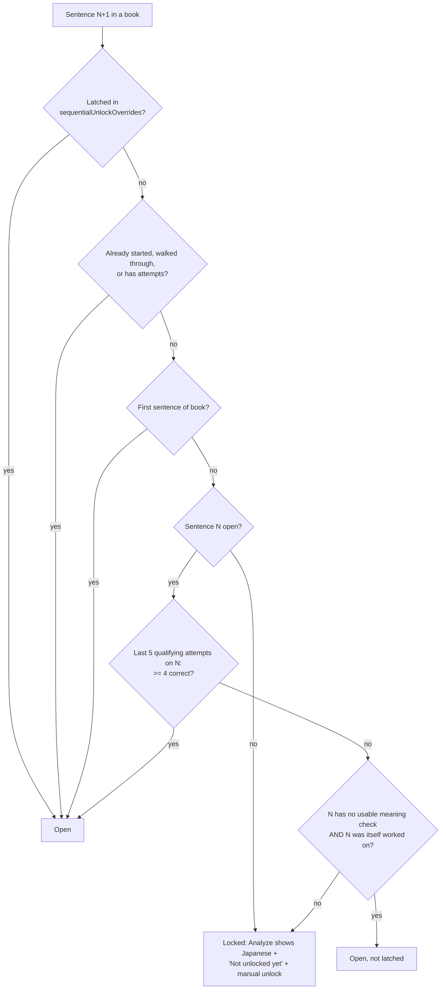
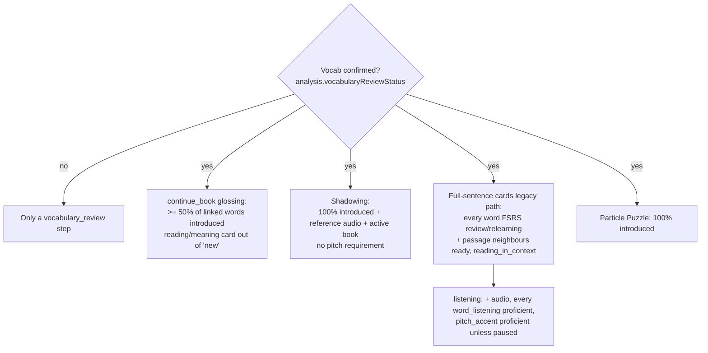

# What unlocks a sentence

Verified against code 2026-10-02. Two layers: *opening* a sentence for study
(sequential mode, optional) and *which activities* a sentence qualifies for.

## 1. Opening a sentence (`src/lib/sequentialStudy.ts`, only when `settings.sequentialStudyMode`)

Qualifying attempt = first pick on a meaning card, before any hint/translation,
at least 10 minutes after the previously counted attempt. Unlocks are latched
(permanent) except the waiver case. Each book is independent.

## 2. Activity gates

Default is the sentence-led flow (`sentenceLedFlow`, on): word/grammar drills
are withheld and sentence cards are gated only by having been introduced via
the gloss walkthrough. The vocabulary gates below apply to the legacy path
(`sentenceLedFlow: false`) and to the planner/shadowing/games.

Other gates: `word_listening` and contrastive pairs need reading-only FSRS
proficiency of the word; `grammar_completion` needs the pattern's
`grammar_recognition` proficient; `conjugation` uses the full-review gate.
